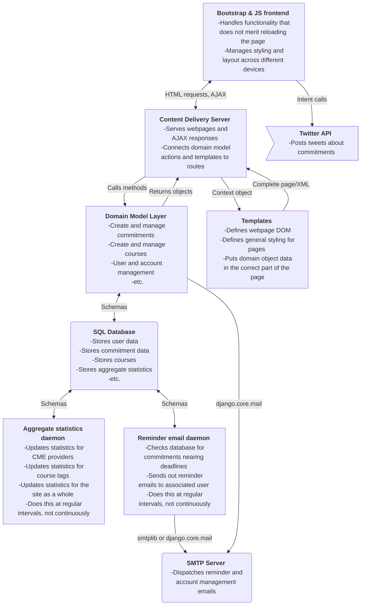

# Architecture

This file outlines the plans for the system architecture.

## Diagram

## Modules

- Reminder email daemon: Since sending an email at a specific time involves a 
lot of waiting around, and since the notification period expected of email is 
more on the order of a day than of a second, it's probably better to make this 
its own service that spends most of its time asleep. It can then check the 
database every 15 minutes or so to see if there are any commitments it needs 
to send notification emails for.

- SMTP server: Some SMTP server is necessary to send emails from Django. Since it must interact with both the reminder email daemon and the main server (account management emails), it should be its own module.

- Statistics update daemon: While updating the statistics for a given course can be done when its page is accessed without performance hits, updating statistics of entire CME providers or courses with similar tags on every request will quickly grind the server to a halt. The solution is to allow them to a little out of date and recompute them at regular intervals, instead of on every request, so this should be its own daemon.

- Database: Since multiple modules need access to the contents of the database,
 it should be seperated into its own module.

- Django content delivery server: Delivers the web page content by processing 
templates. Distinct from templates in that it links them to the domain model 
layer and may only need to return code to AJAX requests.

- Templates: Controls the DOM structure and values of information in the web 
pages. Styling is also applied in this module.

- Domain model layer: Represents domain classes and objects, such 
as commitments, users, and courses.
Handles their creation, modification, deletion, interaction, etc.

- Bootstrap & JS frontend: Handles the display of the web page content, varying
among different devices accessing it. It also handles browser interaction 
that does not merit requesting an entire webpage.

- Twitter API: Since this is a third-party API, it is its own module.

