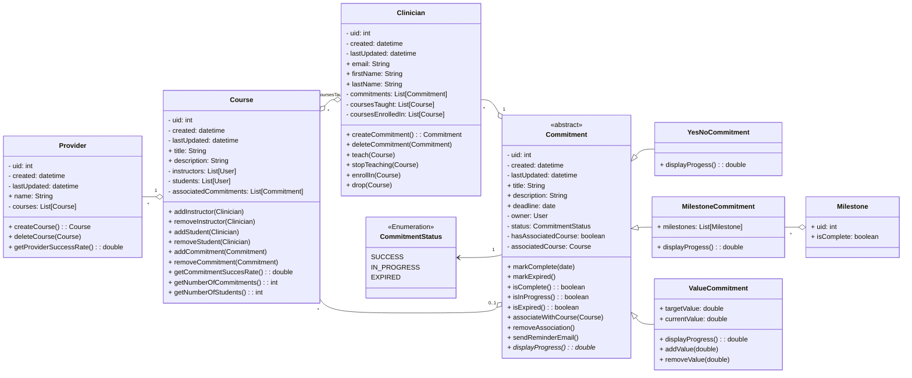

# Domain Model

This file displays and describes the domain model for the project.

## Model Diagram

  

## Classes
- Clinician
  - A medical professional, usually a physician and in continuing medical 
education. These are the main users of the platform who use to to make 
commitments. Medical educators are also modeled as this class, as they may also
make commitments and/or be taking CME courses.

- Commitment
  - A goal to positively change delivery of patient care that is made by a 
clinician. Most of these commitments should take place in the context of 
implementing practices learned in a CME course and therefore will have an 
associated Course. Note that several examples of commitment types are listed
below, but are not necessarily exhaustive.

- CommitmentStatus
  - The current state of a Commitment, whether completed successfully, in 
progress, or expired (reached the deadline without total completion). Other 
statuses might be possible in the future, so backwards compatibility is 
important for this enumeration.

- YesNoCommitment
  - The most simple type of Commitment. This covers goals that could be phrased
in terms of a yes or no question.

- MilestoneCommitment
  - This models Commitments that might have multiple steps along the way. This
allows clinicians to break bigger goals into smaller ones and display their 
progress, both to themself and to others in the community.

- ValueCommitment
  - This models Commitments that consist of trying to reach a specific quantity.
An example would be a commitment to hold a certain number of clinic hours 
before the deadline.

- Course
  - This represents a course in continuing medical education. Importantly,
associating commmitments with a course is important on gathering data for CME
providers on how much change the course actually caused.

- Provider 
  - These are the objects that represent CME providers. CME providers are 
organizations and therefore behave very differently from other clinician users.
Providers may create courses and optionally suggest commitments, but it is up
to clinicians to make changes in practice happen.

