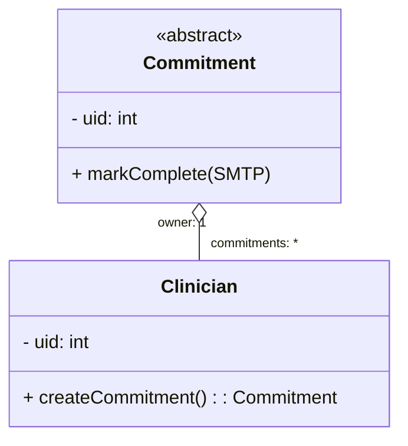

# Domain Model

## Model Diagram

- (Link to the domain model file)

### Proof of concept: mermaid.js

```mermaid
classDiagram
  class Clinician{
    - uid: int
    + createCommitment(): Commitment
  }

  class Commitment{
    <<abstract>>
    - uid: int
    + markComplete(SMTP)
  }

  Commitment "owner: 1" o-- "commitments: *" Clinician

```

  

## Classes
- Class 1
  - Explanation

- Class 3
  - Explanation
