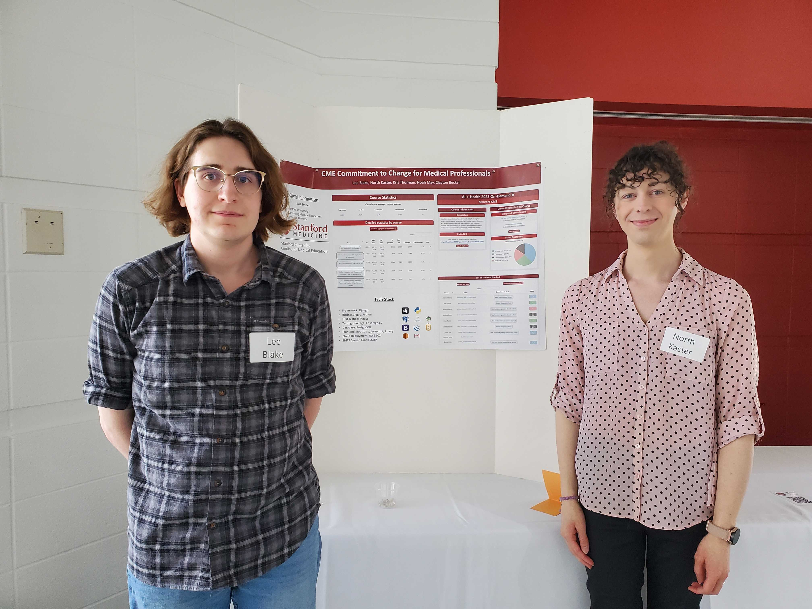
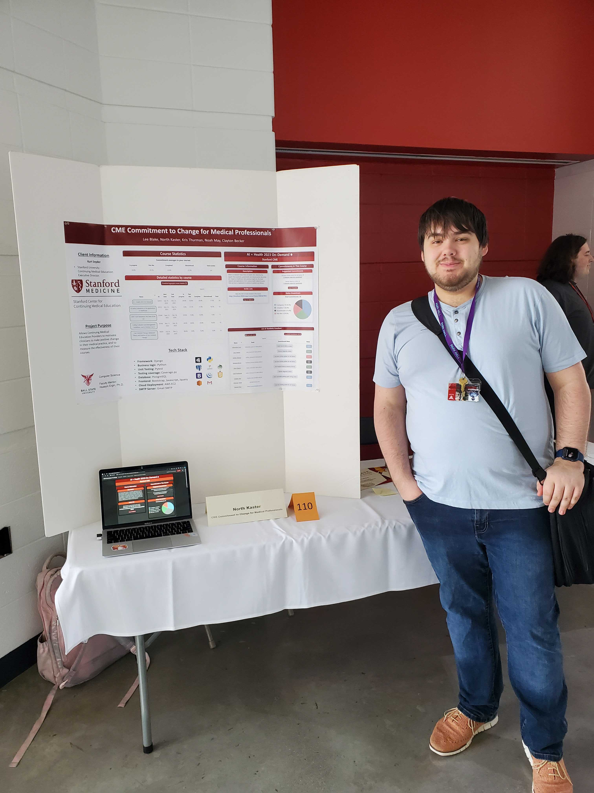
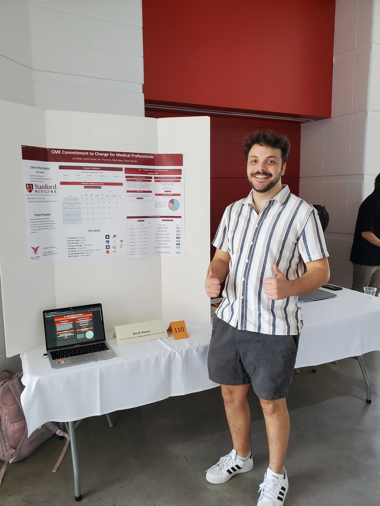
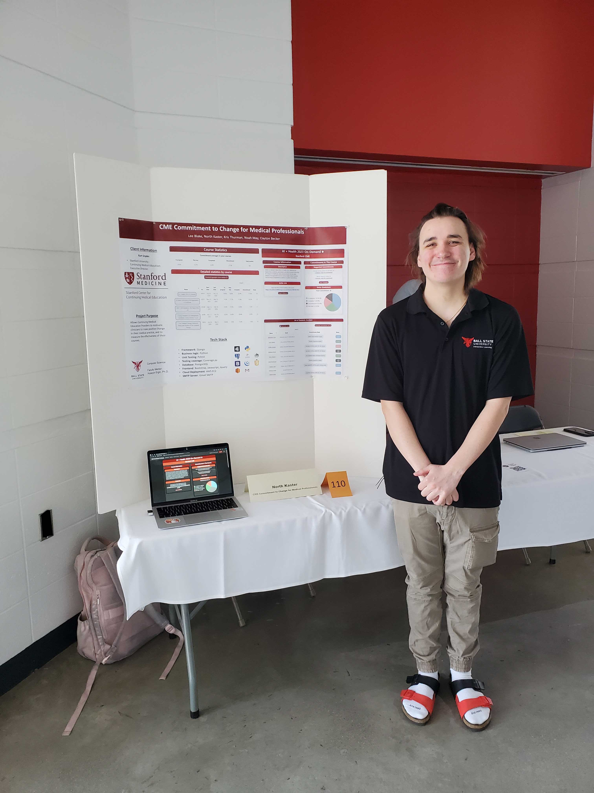
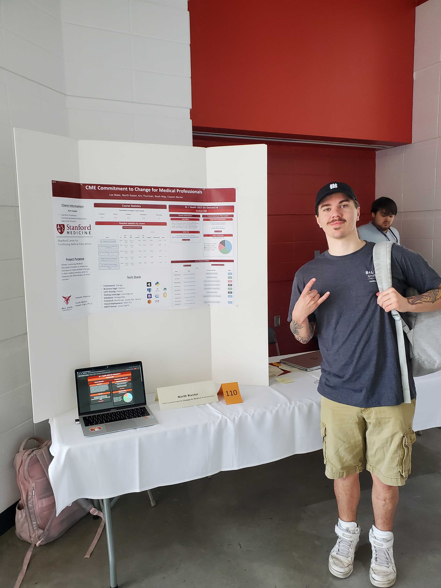
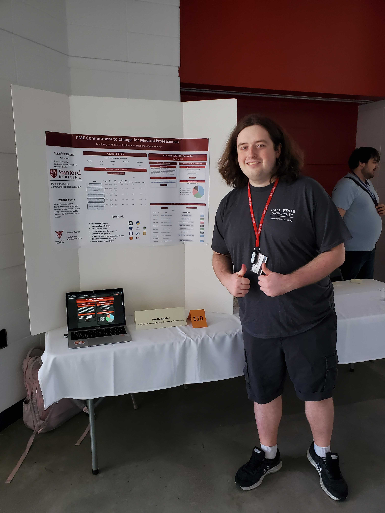
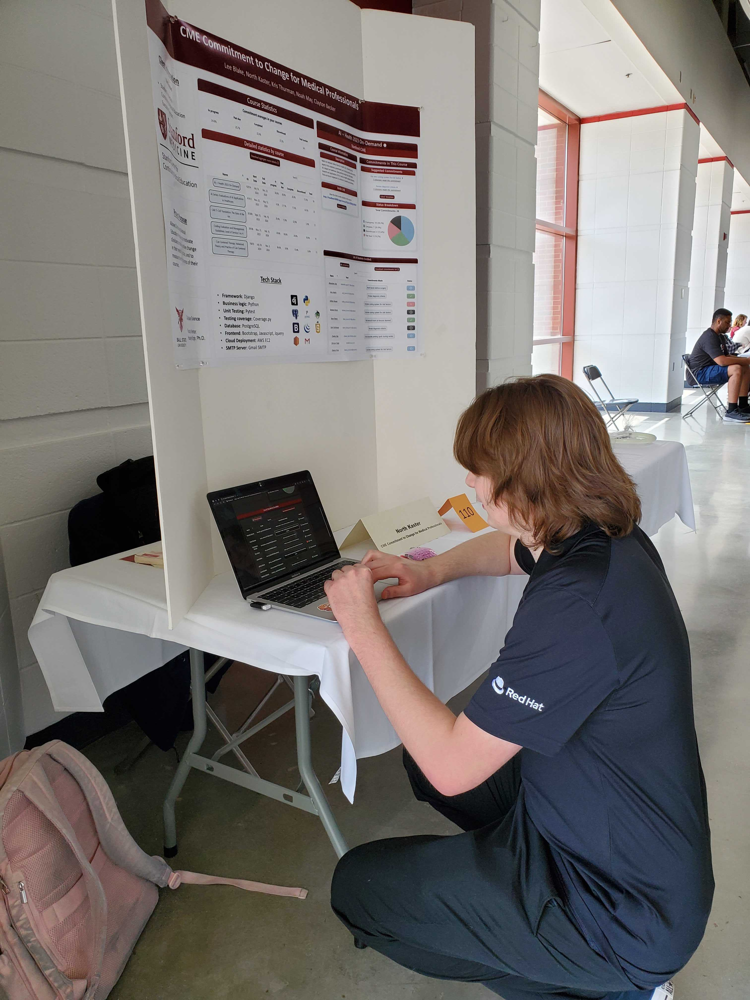
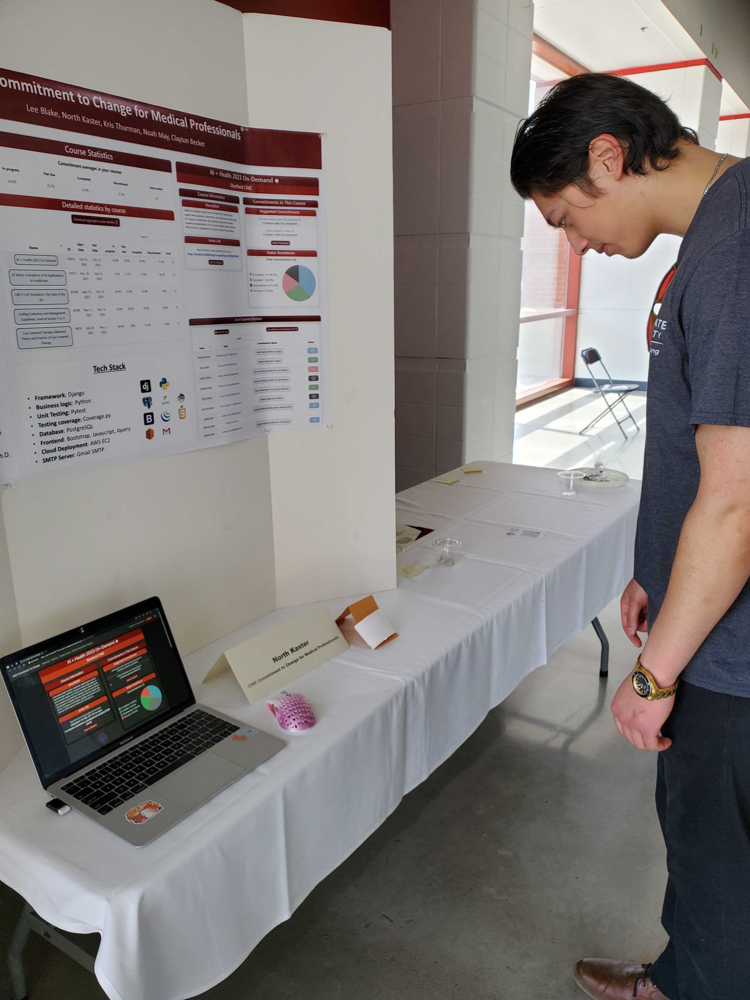
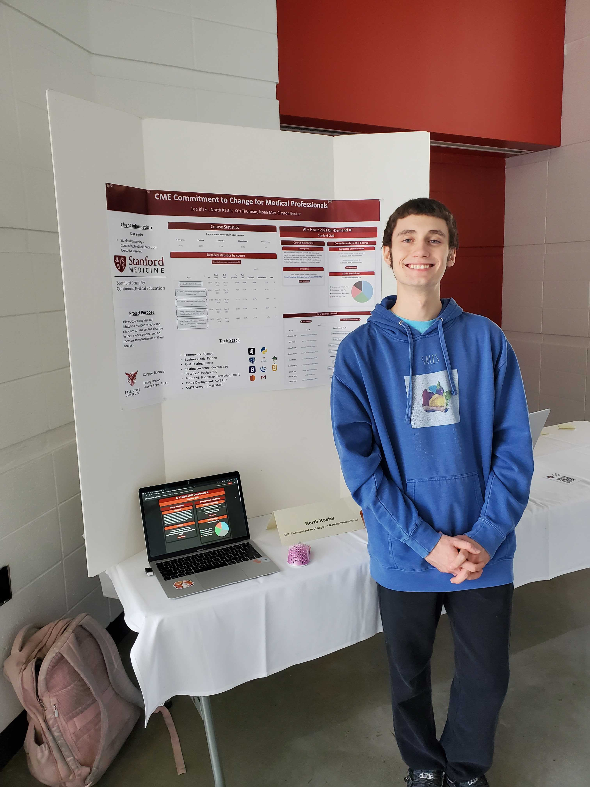

# Student Symposium Presentation
## Poster
The poster we presented is the standard project poster [here](../Presentations/CME-Commitment-to-Change-poster.pdf).

## Team Photo

Pictured: Lee Blake & North Kaster at the symposium

## Selected Attendees

- The CME Quest Adventures team
  - Jared Bowman

    

  - Jack Carthew

    

  - Justyn Fox 

    

  - Micah Harker

    

  - Ethan Hooper

    

- Other attendees
  - Austen Lowder

    

  - Beethoven Meginnis

    

  - Daniel O'Dell

    

## Reflection
Reflections from team members on the symposium are included here.

### Lee
A couple things stood out to me during our presentation at the symposium. First, it was easy to present the project effectively after presenting many times to the client and our classmates. Second, our choices on the presentation poster definitely affected how clearly we could explain things. Having both the course and provider statistics pages made it possible to visually illustrate the two uses of the site. However, it would have been easier if we had the course page from the clinician perspective, as could have shown instead of told. Finally, we were lucky to have good, active listeners. While we spent most of the symposium wait for audience members rather than presenting, those who listened made it clear they were interested and that was very easy to work with.

### North
I have never been great at public communication, so I did not expect to enjoy the symposium as much as I did. Sharing something that we have spent so much time on and are so proud of to people who genuinely wanted to hear about it was very refreshing and helped to make all of the effort worth it. While I thought I had a good grasp on how to present our software, at first I struggled to explain our software and it's purpose in a timely and appropriately detailed manner. As time went on it became easier, but if I were to do it again I would have prepared a few general talking points and walked through it a bit more, just as one would prepare for a public speech. I also wish I had explicitly invited more people to actually try our software, as our software was already setup in front, but no one really tried it. Many of the people there were more interested in research and other fields, and I think getting some hands-on experience with something we created would have helped us leave an even more favorable impression.
